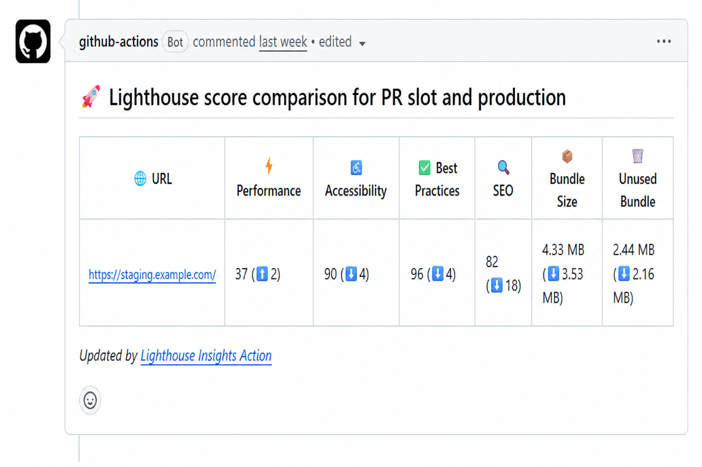

# Lighthouse Insights Action

GitHub Action that runs Lighthouse CI audits and generates human-friendly Markdown reports — including pull request comparisons against a production baseline.

Use this when you want a **single workflow step** instead of stitching together LHCI, custom report scripts, and artifact uploads.

## Features

- Run Lighthouse CI from one action step
- Simple mode (`urls`), domain+paths mode, or advanced mode (`config-path`)
- With production + staging domains: main audits production, PRs audit staging and show score deltas
- Markdown report: Performance, Accessibility, Best Practices, SEO, Bundle Size, Unused Bundle
- PR vs production score/bundle comparison
- GitHub Step Summary
- Optional Markdown + raw `.lighthouseci` artifact uploads
- Outputs for downstream steps

## Quick start

```yaml
name: Lighthouse

on:
  push:
    branches: [main]
  pull_request:

jobs:
  lighthouse:
    runs-on: ubuntu-latest
    steps:
      - uses: actions/checkout@v6

      - name: Setup Chrome
        id: chrome
        uses: browser-actions/setup-chrome@v1

      - name: Lighthouse CI
        id: lighthouse
        uses: amankumarrr/lighthouse-insights-action@v1
        env:
          CHROME_PATH: ${{ steps.chrome.outputs.chrome-path }}
        with:
          urls: |
            https://example.com
            https://example.com/about
          upload-report: true
          upload-raw-results: true
```

The action will:

1. Run Lighthouse CI
2. Generate a Markdown report
3. Publish it to the job **Summary**
4. Upload artifacts (when enabled)
5. Set outputs such as `report` and `report-path`

## Inputs

| Input | Description | Default |
| --- | --- | --- |
| `urls` | Full URLs to audit (highest priority when set) | |
| `paths` | Paths to audit (newline or comma-separated), used with domain inputs | |
| `production-domain` | Production origin, e.g. `https://www.example.com` | |
| `staging-domain` | Staging/preview origin, e.g. `https://staging.example.com` | |
| `default-domain` | Default origin used with `paths` when both staging and production are not set | |
| `config-path` | Optional LHCI config (e.g. `.lighthouserc.json`). Not auto-detected; takes precedence over urls/paths | |
| `results-path` | Directory for Lighthouse CI results | `.lighthouseci` |
| `production-report` | Markdown baseline from a production run; used on PRs for path-based comparison | `prod-lighthouse-report.md` |
| `upload-summary` | Publish the report to the GitHub Step Summary | `true` |
| `upload-report` | Upload the Markdown report as an artifact | `true` |
| `upload-raw-results` | Upload the raw `.lighthouseci` results | `false` |
| `comment-on-pr` | On `pull_request`, create/update a sticky PR comment with the report | `false` |
| `report-artifact-name` | Artifact name for the Markdown report | `lighthouse-report` |
| `raw-results-artifact-name` | Artifact name for raw results | `lighthouse-results` |

## Outputs

| Output | Description |
| --- | --- |
| `report` | Generated Markdown report content |
| `report-path` | Path to the written Markdown report file |
| `results-path` | Path to the Lighthouse CI results directory |
| `report-artifact-name` | Uploaded Markdown artifact name (empty if not uploaded) |
| `raw-results-artifact-name` | Uploaded raw-results artifact name (empty if not uploaded) |

Example:

```yaml
- name: Lighthouse CI
  id: lighthouse
  uses: amankumarrr/lighthouse-insights-action@v1
  with:
    urls: |
      https://example.com

- name: Use report output
  run: echo "${{ steps.lighthouse.outputs.report-path }}"
```

## Configuration modes

The action does **not** auto-detect `.lighthouserc` / `.lighthouserc.json`.

| Priority | Mode | How to enable | What it does |
| --- | --- | --- | --- |
| 1 | Advanced | `config-path: ./.lighthouserc.json` | Uses your LHCI config (URLs come from that file) |
| 2 | Explicit URLs | `urls` | Audits exactly those full URLs |
| 3 | Domains + paths | `paths` + domain inputs | Builds URLs from domains and paths (see below) |

### Domains + paths

```yaml
paths: |
  /
  /about
production-domain: https://www.example.com
staging-domain: https://staging.example.com
default-domain: https://example.com
```

Behavior when **both** `production-domain` and `staging-domain` are set:

| Event | What is audited | Report |
| --- | --- | --- |
| `push` / non-PR | **Production** URLs only | Absolute scores; writes baseline |
| `pull_request` | **Production + staging** | **Staging URLs only**, with ⬆️/⬇️ vs production from the same run |

No baseline artifact is required for PR deltas when both domains are configured — production is audited in the same PR job and used only for comparison.

Full job example (paths + domains + PR comment):

```yaml
lighthouse:
  runs-on: ubuntu-latest
  permissions:
    contents: read
    pull-requests: write   # required for comment-on-pr
  steps:
    - uses: actions/checkout@v6

    - name: Setup Chrome
      id: chrome
      uses: browser-actions/setup-chrome@v1

    - name: Lighthouse CI
      id: lighthouse
      uses: amankumarrr/lighthouse-insights-action@v1
      env:
        CHROME_PATH: ${{ steps.chrome.outputs.chrome-path }}
      with:
        paths: |
          /
        production-domain: https://www.example.com
        staging-domain: https://staging.example.com
        comment-on-pr: true
```

`.lighthouserc` is only for **how LHCI runs** when you pass `config-path`.  
It is **not** used for PR vs production comparison.

## Simple usage (URLs only)

```yaml
- name: Lighthouse CI
  uses: amankumarrr/lighthouse-insights-action@v1
  with:
    urls: |
      https://example.com
      https://example.com/about
```

## Advanced usage (custom `.lighthouserc`)

```yaml
- name: Lighthouse CI
  uses: amankumarrr/lighthouse-insights-action@v1
  with:
    config-path: ./.lighthouserc.json
    upload-report: true
```

Example `.lighthouserc.json`:

```json
{
  "ci": {
    "collect": {
      "url": ["https://example.com"],
      "numberOfRuns": 1
    },
    "upload": {
      "target": "filesystem",
      "outputDir": ".lighthouseci"
    }
  }
}
```

## Pull request vs production comparison

### How it works

Comparison is **not** “two URLs in one run”. It works like this:

1. **On `main` / non-PR** — audit your **production** URLs and save a Markdown baseline (`prod-lighthouse-report.md` by default).
2. **On `pull_request`** — audit your **PR / preview** URLs, then compare those results to the saved baseline.

Rows are matched by **URL path**, not hostname:

| Production URL | PR URL | Matched as |
| --- | --- | --- |
| `https://www.example.com/` | `https://pr-123.example.com/` | `/` |
| `https://www.example.com/about` | `https://pr-123.example.com/about` | `/about` |

So production and PR hosts can differ; paths must line up.

The PR report shows deltas:

- Scores: `90 (⬆️5)` improved vs prod, `85 (⬇️5)` regressed
- Bundle size: smaller is ⬇️, larger is ⬆️

Example PR comment (`comment-on-pr: true`):



If the baseline file is missing on a PR, comparison rows are skipped (warning only).

### What you must provide on PRs

Before the action runs on a PR, put the production Markdown baseline on disk as `production-report` (default `prod-lighthouse-report.md`). Typical options:

- Download the artifact uploaded from the `main` workflow
- Commit a known baseline file
- Restore it from cache / storage

### Full example (production baseline + PR preview)

**On `main`** — audit production and save the baseline artifact:

```yaml
- name: Lighthouse CI (production)
  if: github.event_name != 'pull_request'
  uses: amankumarrr/lighthouse-insights-action@v1
  env:
    CHROME_PATH: ${{ steps.chrome.outputs.chrome-path }}
  with:
    urls: |
      https://www.example.com
      https://www.example.com/about
    production-report: prod-lighthouse-report.md
    upload-report: true
    report-artifact-name: lighthouse-report
```

**On pull requests** — restore that baseline, audit the PR/preview URLs, compare by path:

```yaml
- name: Download production baseline
  if: github.event_name == 'pull_request'
  uses: dawidd6/action-download-artifact@v6
  with:
    github_token: ${{ secrets.GITHUB_TOKEN }}
    workflow: lighthouse.yml   # name of this workflow file
    branch: main
    name: lighthouse-report
    path: .
    search_artifacts: true
    if_no_artifact_found: warn

- name: Lighthouse CI (PR vs production)
  if: github.event_name == 'pull_request'
  uses: amankumarrr/lighthouse-insights-action@v1
  env:
    CHROME_PATH: ${{ steps.chrome.outputs.chrome-path }}
  with:
    urls: |
      https://pr-slot.example.com
      https://pr-slot.example.com/about
    production-report: prod-lighthouse-report.md
    upload-summary: true
    upload-report: true
```

Flow:

1. **main** writes `prod-lighthouse-report.md` and uploads artifact `lighthouse-report`
2. **PR** downloads that file, audits preview URLs, writes `lighthouse-report.md` with ⬆️/⬇️ deltas
3. Paths must match (`/` ↔ `/`, `/about` ↔ `/about`); hosts can differ

## Comment on pull requests

Set `comment-on-pr: true` to post (or update) a sticky PR comment with the Markdown report. No extra comment action is required.

The job needs write access to pull requests:

```yaml
jobs:
  lighthouse:
    runs-on: ubuntu-latest
    permissions:
      contents: read
      pull-requests: write
    steps:
      - uses: actions/checkout@v6

      - name: Setup Chrome
        id: chrome
        uses: browser-actions/setup-chrome@v1

      - name: Lighthouse CI
        uses: amankumarrr/lighthouse-insights-action@v1
        env:
          CHROME_PATH: ${{ steps.chrome.outputs.chrome-path }}
        with:
          paths: |
            /
          production-domain: https://www.example.com
          staging-domain: https://${{ github.head_ref }}.example.com
          comment-on-pr: true
          upload-summary: true
```

On non-PR events the flag is ignored (with a warning).

## Artifact uploads

| Input | What gets uploaded |
| --- | --- |
| `upload-report: true` | Generated Markdown report |
| `upload-raw-results: true` | Full `.lighthouseci` directory (`manifest.json`, `*.report.json`, `*.html`, …) |

```yaml
- name: Lighthouse CI
  uses: amankumarrr/lighthouse-insights-action@v1
  with:
    urls: |
      https://example.com
    upload-report: true
    upload-raw-results: true
    report-artifact-name: lighthouse-report
    raw-results-artifact-name: lighthouse-results
```

## Complete pipeline example

```yaml
name: Lighthouse

on:
  push:
    branches: [main]
  pull_request:

jobs:
  lighthouse:
    runs-on: ubuntu-latest
    steps:
      - uses: actions/checkout@v6

      - name: Setup Chrome
        id: chrome
        uses: browser-actions/setup-chrome@v1

      - name: Lighthouse CI
        id: lighthouse
        uses: amankumarrr/lighthouse-insights-action@v1
        env:
          CHROME_PATH: ${{ steps.chrome.outputs.chrome-path }}
        with:
          urls: |
            https://example.com
            https://example.com/about
          upload-summary: true
          upload-report: true
          upload-raw-results: false
          production-report: prod-lighthouse-report.md

      - name: Show report path
        run: echo "Report at ${{ steps.lighthouse.outputs.report-path }}"
```

Chrome (or Chromium) must be available on the runner. The action installs `@lhci/cli` automatically when it runs.

After the job finishes, open the workflow run **Summary** tab to view the Markdown report.

## Versioning

Pin to a major version or a specific release:

```yaml
uses: amankumarrr/lighthouse-insights-action@v1
# or
uses: amankumarrr/lighthouse-insights-action@v1.0.0
```

## Development

Contributor setup, local verification, project layout, and release steps live in **[docs/development.md](docs/development.md)**.
